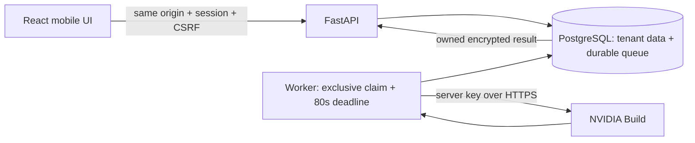

# Architecture and API

Each workspace/job is owned by one user. Teams and cross-user shared projects are
not in this MVP. Global roles are `admin` and `member`. Authorization is enforced
on every API request and ownership is checked on every job/workspace lookup.

Public API: `/health`, `/ready`, `/api/auth/login`, `/api/auth/register` (requires
one-time email-bound invitation). All mutations require exact `Origin`; authenticated
mutations also require session CSRF header. `/api/auth/me` supplies the CSRF token
and user metadata. Sessions expire in 12 hours; password changes revoke all old
sessions and rotate the current session.

Authenticated routes:

- `/api/workspaces` GET/POST, at most 20 owned workspaces.
- `/api/models` GET: documented allowlist with capability, license, catalog/access and price status.
- `/api/jobs` POST: workspace_id, model_id, messages (user/assistant), kind text/chat,
  max_tokens 64–2048, temperature 0–1. Up to 12 messages, each 8000 characters,
  at most 12000 characters in total. Last message must be a user message.
  Include a 16–128 printable ASCII `Idempotency-Key`; duplicate identical submissions
  return the original job and never reserve another credit or dispatch another call.
- `/api/jobs` GET: last 50 owned job metadata rows, optionally owned workspace filter.
- `/api/jobs/{id}` GET: owned decrypted result, actual/unknown usage and safe error.
- `/api/jobs/{id}/cancel` POST: queued-only cancellation/refund.
- `/api/jobs/{id}/content` DELETE: clear encrypted content after job termination,
  keep usage/accounting metadata.
- `/api/usage` GET: rolling 24-hour request/token totals, known cost subtotal and unknown count.
- `/api/billing` GET: explicitly disabled; `/api/billing/checkout` POST returns 503.
- `/api/auth/password`, `/api/auth/logout` POST.

Admin routes: overview/users/audit/models GET, invitations POST, user/role/quota PATCH,
credit grant POST, model enabled/price/approval PATCH and `/api/admin/models/refresh`
POST. The last active admin cannot be demoted or disabled. Credit adjustments create
an audit event containing amount and a reason hash, never free-form private text.

## Queue and accounting

API reservations lock a singleton budget control row then the user row. Global
request/cost limits, per-user request/token limits and credits are checked in one
transaction before inserting a job. Pricing is nullable and captured per job;
changing later model prices never rewrites existing accounting.

Workers claim with `FOR UPDATE SKIP LOCKED`. A dispatch marker is committed before
the provider request. The HTTP read timeout is 60 seconds, connect timeout 10, and
an independent 80-second total deadline precedes the 120-second worker lease.
Expired undispatched work can be safely requeued; dispatched stale work becomes
`uncertain`. Ambiguous timeout/network/5xx/malformed-success responses are not
refunded or retried automatically. Definitively rejected/unsent work is refunded.
Partial text with a `length` finish reason is stored with a visible truncation flag.
Missing usage stays null; reservations remain conservative rather than pretending
that tokens/cost were zero.

`queued → running → succeeded / failed / uncertain`; queued work can also become
`cancelled`. Completion is conditional on the matching claim and state so a stale
worker cannot overwrite recovered work. Jobs remain idempotent across restarts.

PostgreSQL is the durable queue; Redis/Celery is unnecessary for this bounded MVP.
One API worker and one queue worker are the default. Multiple queue workers can
claim safely, but operational throughput and per-provider concurrency must be
reviewed before increasing worker replicas.
